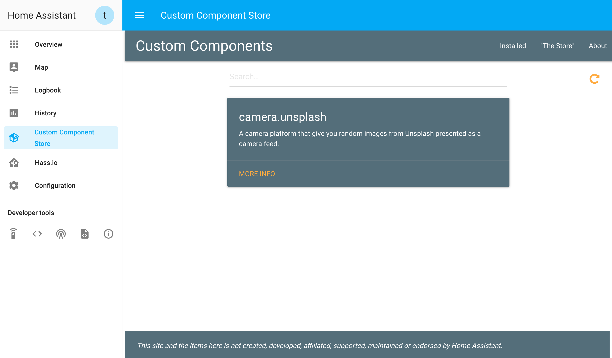

# Miscellaneous Hass.io Addons: Custom Component Store

An easy-to-use web app for managing custom components. This is a Hass.io addon for the program made by [Ludeeus](https://github.com/ludeeus/custom-component-store)




## Installation

1. [Add the main Miscellaneous Hass.io Addons repo]() to your Hass.io instance.
2. Install the "Custom Component Store" add-on.
3. Start the "Custom Component Store" add-on
4. Check the logs of the "Custom Component Store" add-on to see if everything went well.
5. Load up your Hass.io instance and use port `8100`
    (e.g. `http://hassio.local:8100`).
6. Login using your Home Assistant credentials.


## Configuration

**Note**: _Remember to restart the add-on when the configuration is changed._

Example add-on configuration:

```json
{
  "log_level": "info",
  "ssl": true,
  "certfile": "fullchain.pem",
  "keyfile": "privkey.pem"
}
```

### Option: `log_level`

The `log_level` option controls the level of log output by the addon and can
be changed to be more or less verbose, which might be useful when you are
dealing with an unknown issue. Possible values are:

- `trace`: Show every detail, like all called internal functions.
- `debug`: Shows detailed debug information.
- `info`: Normal (usually) interesting events.
- `warning`: Exceptional occurrences that are not errors.
- `error`:  Runtime errors that do not require immediate action.
- `fatal`: Something went terribly wrong. Add-on becomes unusable.

Please note that each level automatically includes log messages from a
more severe level, e.g., `debug` also shows `info` messages. By default,
the `log_level` is set to `info`, which is the recommended setting unless
you are troubleshooting.

Using `trace` or `debug` log levels puts the cloud9 server into debug mode
as well.

### Option: `ssl`

Enables/Disables SSL (HTTPS) for the Custom Component Store. Set it `true` to enable it,
`false` otherwise.

### Option: `certfile`

The certificate file to use for SSL.

**Note**: _The file MUST be stored in `/ssl/`, which is default for Hass.io_

### Option: `keyfile`

The private key file to use for SSL.

**Note**: _The file MUST be stored in `/ssl/`, which is default for Hass.io_


## Embedding into Home Assistant

It's possible to emebed the Custom Component Store directly into the Home Assistant frontend.

You can do this with the `panel_iframe` component.

Example configuration:

```yaml
panel_iframe:
  custom_components:
    title: Custom Component Store
    icon: mdi:package-variant
    url: http://your.hassio.url:8100/
```


## Issues and Limitations

This addon is always built locally when installing due to the lack of pre-built images. This will prolong the installation/update process, and the slow-down may or may not be noticeable, depending on your internet connection and/or the speed of the machine that you are installing the add-on on.


## License

MIT License

Copyright (c) 2017-2019 Antoni K <antoni-k@outlook.com>

Permission is hereby granted, free of charge, to any person obtaining a copy
of this software and associated documentation files (the "Software"), to deal
in the Software without restriction, including without limitation the rights
to use, copy, modify, merge, publish, distribute, sublicense, and/or sell
copies of the Software, and to permit persons to whom the Software is
furnished to do so, subject to the following conditions:

The above copyright notice and this permission notice shall be included in all
copies or substantial portions of the Software.

THE SOFTWARE IS PROVIDED "AS IS", WITHOUT WARRANTY OF ANY KIND, EXPRESS OR
IMPLIED, INCLUDING BUT NOT LIMITED TO THE WARRANTIES OF MERCHANTABILITY,
FITNESS FOR A PARTICULAR PURPOSE AND NONINFRINGEMENT. IN NO EVENT SHALL THE
AUTHORS OR COPYRIGHT HOLDERS BE LIABLE FOR ANY CLAIM, DAMAGES OR OTHER
LIABILITY, WHETHER IN AN ACTION OF CONTRACT, TORT OR OTHERWISE, ARISING FROM,
OUT OF OR IN CONNECTION WITH THE SOFTWARE OR THE USE OR OTHER DEALINGS IN THE
SOFTWARE.

### Additional licenses
Additional licenses for third-party components of this addon are available as part of the [OTHER_LICENSES.md](OTHER_LICENSES.md) file.